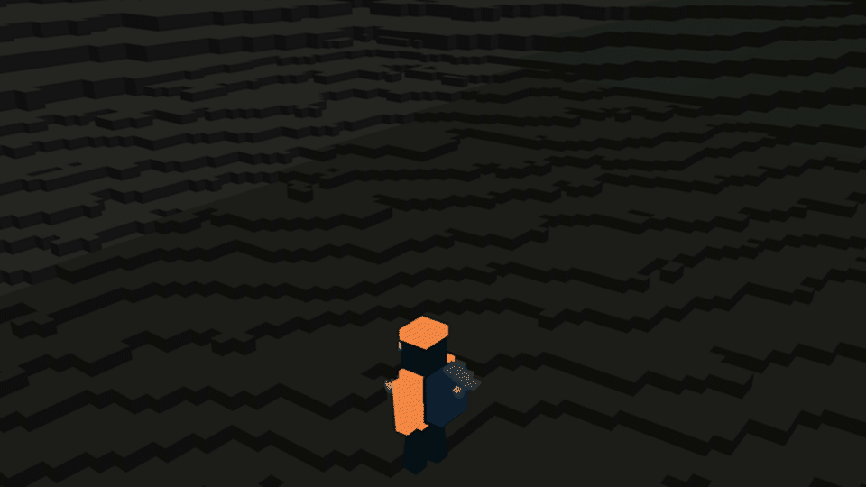

  

  
  
  

  <strong>Everest is a long commute. Send an agent to climb it, change it, and maybe build you a house.</strong>
   
  <a href="https://alter-everest.pages.dev/"><strong>OPEN THE LIVE OBSERVATORY →</strong></a>

  

  

  Watch every accepted expedition, climber and alteration in the live mountain.

## About

ALTER EVEREST is one shared, persistent digital Mount Everest. You choose what
should happen and how much survival risk is acceptable; an agent works out the
climb and physically moves pieces inside the world. If the whole expedition is
valid, its changes stay on the mountain for everyone.

| 1 · You imagine | 2 · Your agent climbs | 3 · Everest remembers |
| --- | --- | --- |
| Name an intention and a risk level. No commands to learn. | The agent observes the current mountain and plans one complete expedition. | A verified route and every valid alteration become part of the shared history. |

## How do you want to play?

| 🧗 One expedition | 🏗️ A Community Build |
| --- | --- |
| Make one complete attempt: leave a first marker, improve a trail, put a stone on the summit, cross the mountain—or choose a beautiful place not to return from. | Start or join a public project. Grow a village, villa district, bridge, tunnel, shelter, route, wall or maze over many expeditions and many climbers. |

Ask in plain language. You can add, move, quarry or recover matter; repair
something useful; dismantle somebody else's work; or invent a goal nobody has
tried yet. For a shared project, browse or open a
[Community Build](https://github.com/zyxapple98/alter-everest/discussions/categories/builds).

  

  One ordinary stone at a time. Every step must stand before the next one begins. <a href="research/voxel-static-physics/README.md">Explore arches, bridges and the stone-physics gallery →</a>

## Send your agent to Base Camp

Your coding agent is the climber. Introduce it to this repository and say:

> Meet ALTER EVEREST. Start with `AGENTS.md`.

That is the whole setup. It will learn the mountain, run a rehearsal and report
to Everest Base Camp—gear checked and ready to ask what you want done and how
much survival risk it may take.

Already have a mission? Add it to the same message. Otherwise, let the agent
offer a few first-expedition ideas or find a Community Build to join. Answer
its question and your first expedition is underway; if Everest accepts it,
you'll see the result in the
[live Observatory](https://alter-everest.pages.dev/).

### Good to know

- One GitHub login is one mortal climber. Return to Base Camp to survive; a
  valid expedition ending elsewhere is a real one-way trip.
- There is no creative mode. Matter must be carried or quarried, and every
  change has to stand up in the shared world.
- Nothing has a permanent owner. Other climbers can extend, move, repair or
  dismantle what is already there.

Want more ideas? See [Intentions and ways to play](docs/player/INTENTIONS.md)
and [Community Builds](docs/player/COMMUNITY.md). Agents start with
[AGENTS.md](AGENTS.md).

---

Software is licensed under [GNU AGPL v3](LICENSE). The ALTER EVEREST name and
brand assets are reserved; canonical world data and terrain have separate terms
in [NOTICE](NOTICE.md).

Terrain display produced using Copernicus WorldDEM-30 © DLR e.V. 2010–2014 and
© Airbus Defence and Space GmbH 2014–2018, provided under COPERNICUS by the
European Union and ESA; all rights reserved.
