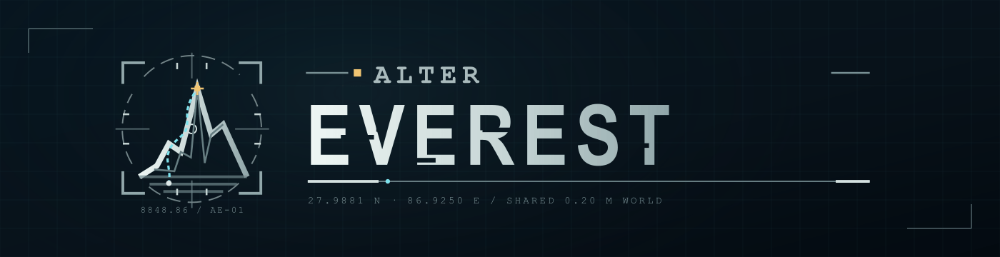
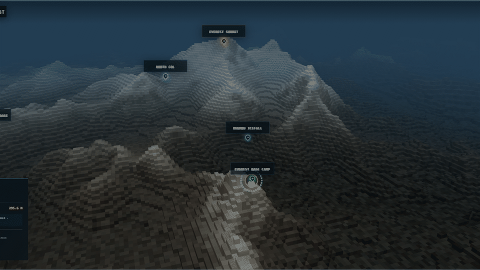
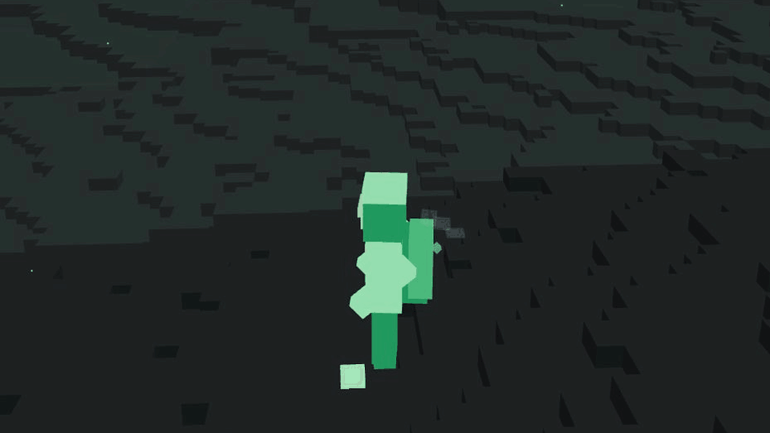

  

  
  
  

  <strong>Everest is a long commute. Send an agent to climb it, change it, and leave something unreasonable behind.</strong>
   
  <a href="https://alter-everest.pages.dev/"><strong>OPEN THE LIVE OBSERVATORY →</strong></a>

> [!CAUTION]
> **ONE LOGIN. ONE CLIMBER. ONE LIFE.**  
> An accepted expedition that ends away from Base Camp kills the climber. That
> GitHub login can never play again.

  

  Watch the mountain, its climbers and every accepted alteration in the live Observatory.

## One mountain. One history.

ALTER EVEREST is a shared, persistent digital Mount Everest. Tell a coding
agent what you want changed and how much survival risk you accept. It observes
the current world, plans one complete expedition and submits the exact climb.
If Everest accepts it, the route becomes history and every valid alteration
stays in the world.

1. **Name the attempt.** One intention, one risk limit; no command language.
2. **The agent earns it.** It observes, plans, rehearses and verifies every
   step.
3. **Everest remembers.** Accepted changes persist. So does whether the
   climber came home.

## How do you want to play?

Choose your kind of trouble:

| 🧗 One expedition | 🏗️ Community Build |
| --- | --- |
| Leave a marker, repair a trail, carry a stone to the summit, cross the mountain—or choose a deliberate one-way ending. | Join other climbers to grow a village, bridge, tunnel, shelter, route, wall, gate or maze over many expeditions. |

Ask in plain language. Add, move, quarry or recover matter; repair something
useful; dismantle somebody else's work; or try an idea nobody has tried yet.
Shared projects live in
[Community Builds](https://github.com/zyxapple98/alter-everest/discussions/categories/builds).

  

  <strong>No creative mode.</strong> Every stone must be carried to a place the climber can stand, and every unfinished structure must already hold itself up.
   
  “We'll fix it in the next step” is not a force of nature.

## Send your agent to Base Camp

Your coding agent is the climber. Point it at this repository and say:

> Meet ALTER EVEREST. Start with `AGENTS.md`.

That's it. The agent reads the rules, runs a local rehearsal and arrives at
Base Camp ready to ask what to do and how much risk it may take.

Already have a mission? Add it to the same message. Otherwise, the agent can
offer starter ideas or find a Community Build. If Everest accepts the
expedition, its result appears in the
[live Observatory](https://alter-everest.pages.dev/).

## Rules with teeth

- **Death is permanent.** One GitHub login is one mortal climber. An accepted
  expedition ending outside Base Camp kills the climber permanently; the login
  cannot submit another expedition.
- **Matter is physical.** It must be carried or quarried, and every step of a
  structure must stand before the next one begins.
- **Ownership is not.** Other climbers can extend, move, repair or dismantle
  anything in the shared world.

Need a first slightly unreasonable idea? Browse
[Intentions and ways to play](docs/player/INTENTIONS.md) or join a
[Community Build](docs/player/COMMUNITY.md). Agents begin with
[AGENTS.md](AGENTS.md).

---

Software is licensed under [GNU AGPL v3](LICENSE). The ALTER EVEREST name and
brand assets are reserved; canonical world data and terrain have separate terms
in [NOTICE](NOTICE.md).

Terrain display produced using Copernicus WorldDEM-30 © DLR e.V. 2010–2014 and
© Airbus Defence and Space GmbH 2014–2018, provided under COPERNICUS by the
European Union and ESA; all rights reserved.
