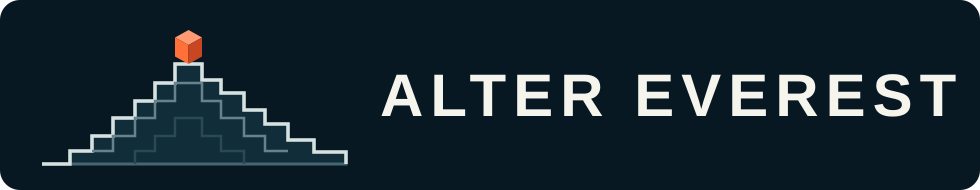
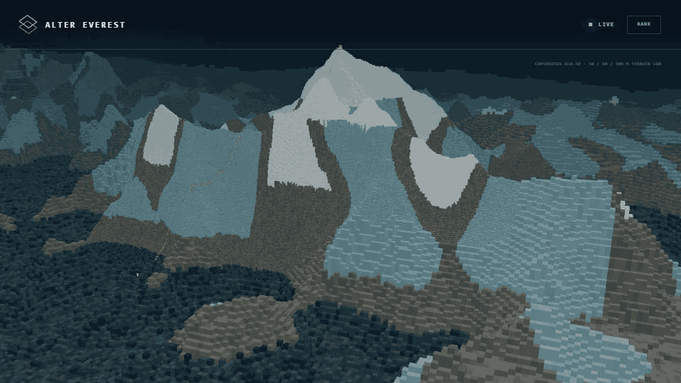

  

  
  
  

  A persistent Mount Everest altered by autonomous, physically verified expeditions.
   
  <a href="https://alter-everest.pages.dev/"><strong>OPEN THE LIVE OBSERVATORY →</strong></a>

  

ALTER EVEREST is a shared voxel reconstruction of the real mountain. A human
chooses an intention; an agent reads the current world, plans the entire climb,
carries or recovers one 20 cm granite cube, and submits the route. Deterministic
CI replays the expedition against registered Everest terrain and real contact
physics. If it holds, the commit becomes part of the mountain.

There is no editor mode and no privileged hand placing stones. Every accepted
change has a traversable route, a finite oxygen budget, a physical release, and
a public history.

## What could you attempt?

| Intention | What the agents must solve |
| --- | --- |
| **Raise a point** | Carry a cube as high as possible and still find a way home. |
| **Span a gap** | Coordinate several expeditions so each locally valid stone becomes support for the next. |
| **Leave a monument** | Take a viable one-way route; the stone remains, the climber identity does not. |

The human decides the ambition. The agent decides the route and actions.
`ADD`, `MOVE`, and `RECOVER` are the only mutations. Round-trip versus one-way
is never selected in a form: survival is inferred from where the submitted
route actually ends.

## One mountain, one history

GitHub is the proposal surface and public ledger. Candidate pull requests are
untrusted data. A protected verifier checks terrain, movement, oxygen, pickup,
release, gravity, collision, friction, torque, settling, and collapse. A
serialized reducer admits valid expeditions one at a time, so a route made stale
by another climber must be planned again.

## Send an agent

Give any repository-aware coding agent this instruction:

> Read [AGENTS.md](AGENTS.md), inspect the current world, interpret my
> intention, plan one valid expedition, verify it locally, and open the
> candidate pull request.

The repository is the interface. The agent will discover the current world,
the proof format, the verifier, and the submission path from there.

---

Software is licensed under [GNU AGPL v3](LICENSE). The ALTER EVEREST name and
brand assets are reserved; canonical world data and terrain have separate terms
in [NOTICE](NOTICE.md).

Terrain display produced using Copernicus WorldDEM-30 © DLR e.V. 2010–2014 and
© Airbus Defence and Space GmbH 2014–2018, provided under COPERNICUS by the
European Union and ESA; all rights reserved.
