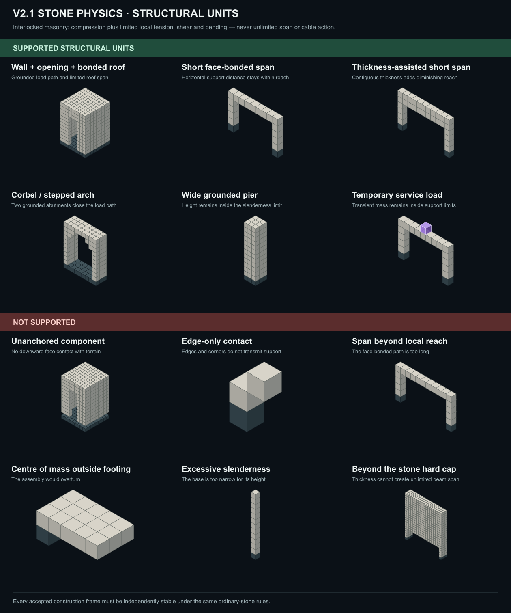
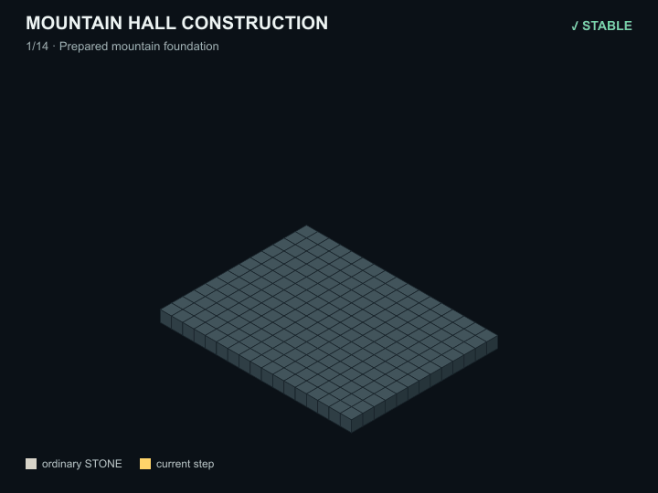
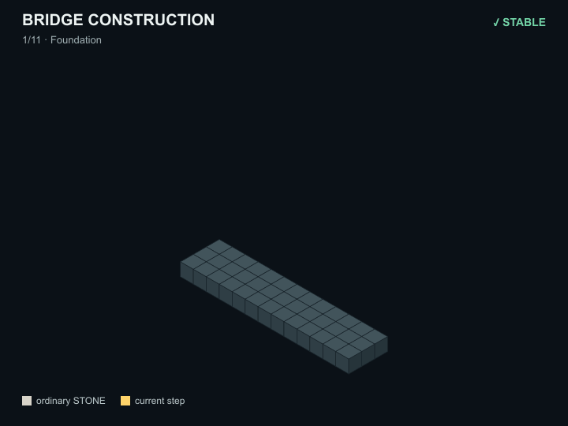
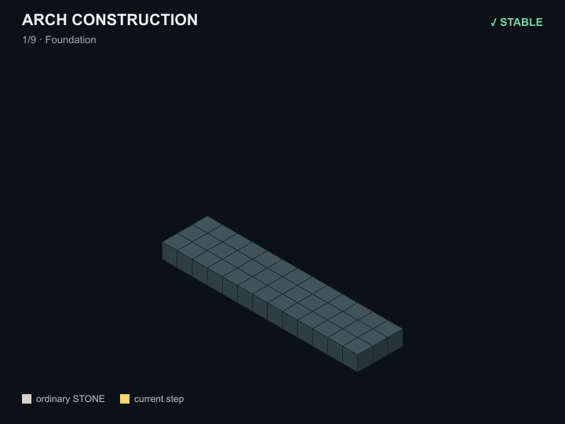

# Voxel static physics visual archive

The V2.1 research rules are now the production
`VOXEL_STATIC_V2_1` contract. The authoritative implementation and limits live
in:

- `engine/physics.ts`
- `engine/constants.ts`
- `engine/surface.ts`
- `protocol/player-rules.json`
- `docs/player/PHYSICS.md`
- `tests/physics.test.ts`

This directory intentionally retains only the presentation assets requested for
future documentation. They depict ordinary stone construction; there is no
special scaffold material.

## What can stand?

  

## Build it one stable step at a time

Every intermediate world must stand on its own. There is no temporary scaffold
material and no final frame that repairs an invalid earlier step.

### Mountain hall

  

### Masonry bridge

  

### Corbelled arch

  

The images are explanatory examples, not engineering certification. Production
acceptance always comes from the current verifier.
